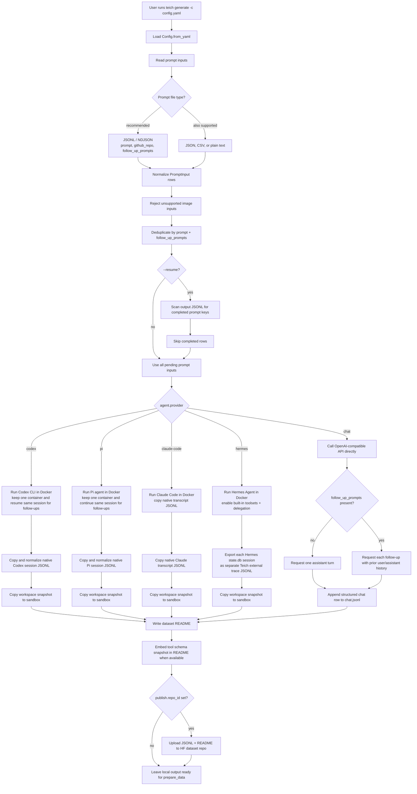
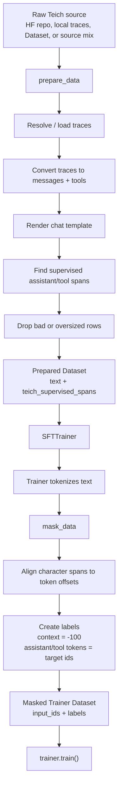

# Generation Flow



## Generation Inputs

Prefer JSONL or NDJSON prompt files for new datasets:

```jsonl
{"prompt":"Build a simple todo list app in React"}
{"github_repo":"armand0e/perplexica-mcp","prompt":"Improve the search flow and update tests"}
{"prompt":"Draft a compact project plan","follow_up_prompts":["Revise it for a solo developer","Add a risk checklist"]}
```

Each row accepts:

- **`prompt`**: required initial user prompt.
- **`github_repo`**: optional `owner/repo` checkout for Docker-backed agent runs.
- **`follow_up_prompts`**: optional list of additional user turns. `agent.provider: chat` generates them as real multi-turn data. Agent runners keep one Docker container alive for the prompt sequence, then resume or continue the same saved agent session for each follow-up.

Provider output behavior:

- `codex`: copies the native Codex session JSONL from mounted `CODEX_HOME/sessions` and normalizes Codex event-shape edge cases so reasoning summaries are visible and split assistant turns render as thinking before text/tool use.
- `pi`: copies the native Pi session JSONL from mounted `/home/codex/pi-sessions`, then normalizes and validates event structure.
- `openclaw`: imported raw OpenClaw traces are recognized when the first session event has `.openclaw` in its `cwd`. OpenClaw is not a Teich runner yet, so Teich only identifies and converts the raw events with `metadata.trace_type = "openclaw"` without applying Pi runner metadata snapshots.
- `claude-code`: copies Claude Code's native transcript JSONL from `.claude/projects/...`, then normalizes split assistant fragments so thinking appears before the text or tool use it explains. During conversion, Claude Code runtime context such as skill listings, MCP instruction deltas, permission context, date changes, hook context, and away summaries becomes masked `system` messages and `metadata.system_prompt`; local slash-command artifacts such as `/model` are filtered, `/goal` contributes its actual user goal text, queued prompts become real user turns, and advertised native Claude Code / Claude Desktop tools receive schemas even when a tool is only declared through deferred-tool context. For OpenRouter non-Claude models, a local proxy gives Claude Code a Claude surrogate model while forwarding the configured model to OpenRouter.
- `hermes`: enables Hermes built-in toolsets `safe,terminal,file,skills,memory,session_search,delegation`, reads Hermes `state.db`, and writes each Hermes session as its own Teich external trace with `external_session_meta` and `external_message` events. Hermes' internal `system_prompt` stays metadata-only instead of becoming supervised training text. Delegated subagent sessions are separate files linked to the orchestrator by `parent_session_id`.
- `chat`: writes structured training rows directly, without Docker or raw session capture.

During conversion, Teich normalizes split assistant fragments into model-turn order: `reasoning_content` first, optional assistant `content` second, and `tool_calls` last. Reasoning that arrives after assistant text or a tool call is moved back in front of the output it explains.

CSV and plain text prompt files still load, but JSONL is the recommended format because prompts often contain commas, code fences, and newlines.

# `prepare_data` Flow

```mermaid
flowchart TD
    A["User calls prepare_data(source_or_dataset, tokenizer, ...)"] --> B["Resolve HF auth token"]
    B --> B1{"token and hf_token both passed?"}
    B1 -->|"different values"| B2["Raise ValueError"]
    B1 -->|"one value / same value / neither"| C["Resolve source_or_dataset"]

    C --> D{"Input type?"}

    D -->|"datasets.Dataset"| E["Use Dataset directly"]
    E --> E1{"max_examples set?"}
    E1 -->|"yes"| E2["shuffle(seed=3407) + select max_examples"]
    E1 -->|"no"| F["Resolved Dataset"]
    E2 --> F

    D -->|"str or Path"| G["load_traces(source, split, revision, token, cache_dir, local_dir, max_examples)"]
    G --> G1{"Local path exists?"}
    G1 -->|"yes"| G2["Use local file / directory"]
    G1 -->|"no"| G3["snapshot_download HF dataset repo"]
    G3 --> G4["Downloads JSONL + README.md"]
    G2 --> G5["Find split directory if present"]
    G4 --> G5
    G5 --> G6["convert_traces_to_training_data"]
    G6 --> G7["Drop rows ending on tool results by default"]
    G7 --> G8["Apply tool schema snapshot from README.md or tools.json"]
    G8 --> G8A["Create datasets.Dataset"]
    G8A --> G9{"max_examples set?"}
    G9 -->|"yes"| G10["shuffle(seed=3407) + select max_examples"]
    G9 -->|"no"| F
    G10 --> F

    D -->|"sequence of plain sources"| H["Resolve each source independently"]
    H --> I["format_data handles sequence"]
    I --> I1["Format each Dataset independently"]
    I1 --> I2["concatenate_datasets"]
    I2 --> Z["Return prepared text Dataset"]

    D -->|"mapping or sequence with source configs"| J["Parse source mix"]
    J --> J1["Read source, name, percentage / weight, per-source max_examples"]
    J1 --> J2["Compute mix probabilities"]
    J2 --> J3["Resolve each source independently"]
    J3 --> K["Format each source independently"]
    K --> K1["Allocate row counts from probabilities + available rows + global max_examples"]
    K1 --> K1A{"Explicit percentage / weight?"}
    K1A -->|"yes"| K1B["Scale total down to keep true ratios"]
    K1A -->|"no"| K1C["Redistribute equal-default capacity"]
    K1B --> K2["Shuffle each source, select allocated rows"]
    K1C --> K2
    K2 --> K3["Concatenate selected sources"]
    K3 --> K4["Final deterministic shuffle(seed=3407)"]
    K4 --> Z

    F --> L["format_data(Dataset, tokenizer, ...)"]
    L --> M["Validate chat_template_kwargs"]
    M --> N["Resolve text tokenizer"]
    N --> O["Resolve chat template renderer"]
    O --> P["dataset.map over rows"]

    P --> Q["Validate messages column is a list"]
    Q --> R["Validate tools column is a list or default []"]
    R --> R1{"validate_tools=True?"}
    R1 -->|"yes"| R2["Validate tool-call names and required args against row tools"]
    R1 -->|"no"| S["_supervised_text_and_spans"]
    R2 --> S

    S --> S1["Deep-copy messages"]
    S1 --> S2["Inject invisible markers around typed candidate fields"]
    S2 --> S3["Candidate fields: assistant reasoning, final answers, tool calls, tool responses, user/system/developer text"]
    S3 --> S7["Render marked chat template"]
    S7 --> S8["Strip markers and collect character spans"]
    S8 --> S8A{"Markers collected cleanly?"}
    S8A -->|"no"| S8B["Render original chat template and infer assistant/model spans"]
    S8B --> S8C{"Fallback spans found?"}
    S8C -->|"yes"| T
    S8C -->|"no and strict=True"| S11["Raise ValueError"]
    S8C -->|"no and strict=False"| S12["Return original text with no spans"]
    S8A -->|"yes"| S9["Render original chat template"]
    S9 --> S10{"Marked-stripped text equals original text?"}
    S10 -->|"no and strict=True"| S11["Raise ValueError"]
    S10 -->|"no and strict=False"| S12["Infer assistant/model spans from original text"]
    S10 -->|"yes"| S13["Infer assistant prompt prefixes"]
    S13 --> S14["Expand candidate spans to include relevant template wrappers"]
    S14 --> T["Return text + typed span metadata"]
    S12 --> T

    T --> U{"Any supervised spans?"}
    U -->|"no and strict=True"| U1["Raise ValueError"]
    U -->|"no and strict=False"| U2["Drop row"]
    U -->|"yes"| V{"max_length set?"}
    V -->|"yes"| V1["Tokenize or measure rendered length"]
    V1 --> V2{"length > max_length?"}
    V2 -->|"yes + oversized_policy=drop"| V3["Drop oversized row"]
    V2 -->|"yes + oversized_policy=trim_followups"| V4["Trim final follow-up turns, then keep or drop"]
    V2 -->|"yes + oversized_policy=error"| V5["Raise ValueError"]
    V2 -->|"no"| W["Emit prepared row"]
    V -->|"no"| W
    V3 --> Z
    V4 --> W

    W --> X{"teich_masking?"}
    X -->|"true"| X1["Output: text + teich_supervised_spans, plus tokens when tokenize=True"]
    X -->|"false"| X2["Output: text only, plus tokens when tokenize=True"]
    X1 --> Z
    X2 --> Z
    Z --> ZA{"return_report=True?"}
    ZA -->|"yes"| ZB["Return (dataset, PrepareReport)"]
    ZA -->|"no"| ZC["Return dataset"]
```



## What `prepare_data` returns

`prepare_data` returns a **trainer-friendly text dataset**, not final labels.

Each row looks conceptually like:

```python
{
    "text": "<rendered chat template string>",
    "teich_supervised_spans": [
        {"start": 123, "end": 180, "source_start": 140, "source_end": 170, "kind": "tool_call", "role": "assistant"},
        {"start": 220, "end": 260, "source_start": 230, "source_end": 250, "kind": "final_answer", "role": "assistant"},
    ],
}
```

With `teich_masking=False`, rows contain only the rendered `text` column unless `tokenize=True` is also set.

With `tokenize=True`, rows also include `input_ids` and `attention_mask`. Use this mode for the recommended Unsloth / TRL flow so trainer setup treats the dataset as already tokenized and preserves `teich_supervised_spans` until `mask_data()` runs.

Important details:

- **`text`** is what `SFTTrainer` / Unsloth tokenizes when `tokenize=False`; with `tokenize=True`, it stays available for Teich span alignment and preview.
- **`teich_supervised_spans`** are typed character span metadata. `prepare_data()` records candidate spans; `mask_data()` decides which kinds become labels.
- **`teich_masking=False`** skips span metadata and returns plain rendered `text` rows for standard next-token training without Teich labels.
- **Original columns are removed** after formatting unless `preserve_columns=True` or an explicit `preserve_columns=[...]` list is passed. `source`, `metadata`, `raw_index`, and `source_key` are the default provenance columns.
- **Raw trace conversion** stores `metadata.first_message_timestamp` when a source user message has its own timestamp. It is not synthesized from session-start metadata.
- **Oversized examples use `oversized_policy`** when `max_length` is set: `"drop"`, `"trim_followups"`, or `"error"`. The older `drop_oversized_examples` and `trim_oversized_followups` flags still work as aliases.
- **Preparation reports** are available with `return_report=True`. The returned `PrepareReport` includes dropped rows, oversized rows, trimmed rows, token lengths, max token lengths, kept-row ids, and returned row count.
- **Public preflight helpers**: `row_fits_context(row, tokenizer, max_length, chat_template_kwargs)` renders and measures one row, `validate_tool_calls(row)` checks declared tool names and required args, and `trace_is_complete(row)` flags rows that end on a tool result.

# `mask_data` Flow

```mermaid
flowchart TD
    A["User creates SFTTrainer with train_dataset from prepare_data"] --> B["Trainer tokenizes text dataset"]
    B --> C["User calls mask_data(trainer, ...)"]

    C --> D["Resolve tokenizer"]
    D --> D1["Priority: explicit tokenizer"]
    D1 --> D2["Then trainer.processing_class"]
    D2 --> D3["Then trainer.tokenizer"]

    C --> E["Resolve text column"]
    E --> E1["Explicit text_column if passed"]
    E1 --> E2["Else trainer.args.dataset_text_field"]
    E2 --> E3["Else default: text"]

    C --> F["Resolve max supervised token limit"]
    F --> F1["max_supervised_tokens if positive"]
    F1 --> F2["Else trainer.args.max_length if positive"]
    F2 --> F3["Else no supervised-token cap"]

    C --> G{"trainer.args.packing enabled?"}
    G -->|"yes"| G1["Raise ValueError: packing not supported"]
    G -->|"no"| H["Mask train_dataset and eval_dataset"]

    H --> I{"Dataset target"}
    I -->|"train_dataset"| J["Process trainer.train_dataset"]
    I -->|"eval_dataset Dataset"| K["Process trainer.eval_dataset"]
    I -->|"eval_dataset dict"| L["Process each eval split independently"]

    J --> M["_mask_dataset(dataset, dataset_name)"]
    K --> M
    L --> M

    M --> N{"dataset is None?"}
    N -->|"yes"| N1["Return None"]
    N -->|"no"| O{"Is datasets.Dataset?"}
    O -->|"no"| O1["Raise TypeError"]
    O -->|"yes"| P{"input_ids present?"}

    P -->|"no, but text column present"| Q["Tokenize text column"]
    Q --> Q1["Create input_ids + attention_mask"]
    Q1 --> R["Continue"]

    P -->|"yes"| R
    P -->|"no and no text fallback"| P1["Raise ValueError: missing input_ids"]

    R --> S["dataset.map over tokenized rows"]
    S --> T["_mask_tokenized_row"]

    T --> U["Extract tokenized input_ids"]
    U --> V{"Row has text and teich_supervised_spans?"}

    V -->|"yes: normal Teich path"| W["Retokenize original text with offset mappings"]
    W --> W1["Convert character spans into token labels"]
    W1 --> W2{"Trainer input_ids align with full text tokenization?"}
    W2 -->|"exact match"| W3["Use full labels"]
    W2 -->|"prefix match due to truncation"| W4["Truncate labels to input_ids length"]
    W2 -->|"mismatch"| W5["Raise ValueError: token alignment failed"]

    V -->|"no: fallback path"| X["Decode input_ids back to text with offsets"]
    X --> X1["Infer supervised assistant/tool spans from rendered template markers"]
    X1 --> X2["Convert inferred spans into token labels"]

    W3 --> Y["Validate labels"]
    W4 --> Y
    X2 --> Y

    Y --> Y1{"All labels are -100?"}
    Y1 -->|"yes"| Y2["Raise ValueError: fully masked row"]
    Y1 -->|"no"| Z["Return input_ids + labels"]

    Z --> AA["Count supervised tokens"]
    AA --> AB{"supervised tokens > max_supervised_tokens?"}
    AB -->|"yes"| AB1["Drop row"]
    AB -->|"no"| AC["Keep row"]

    AC --> AD["Output masked dataset columns: input_ids + labels"]
    AB1 --> AD

    AD --> AE{"Any rows left?"}
    AE -->|"no, because supervised-token cap dropped all"| AE1["Raise ValueError"]
    AE -->|"yes"| AF{"audit enabled?"}

    AF -->|"yes"| AG["audit_sft_dataset(masked_dataset)"]
    AG --> AG1["Raise on masking/audit errors"]
    AF -->|"no"| AH["Skip audit"]
    AG1 --> AI["Attach preview helper"]
    AH --> AI

    AI --> AJ["Replace trainer.train_dataset / eval_dataset with masked datasets"]
    AJ --> AK["Return trainer"]
```



## What `mask_data` changes

Before `mask_data`, the trainer dataset is typically:

```python
{
    "text": "...",
    "teich_supervised_spans": [...],
    "input_ids": [...],
    "attention_mask": [...],
}
```

After `mask_data`, Teich replaces trainer datasets with:

```python
{
    "input_ids": [...],
    "labels": [-100, -100, 1234, 5678, ...],
}
```

Where:

- **`-100`** means “ignore this token in loss.”
- **Non-`-100` labels** are the exact tokens selected by the `mask_data()` training policy.
- By default, prompt/user/system/developer/tool-output context stays masked.
- By default, assistant reasoning, final answers, and tool calls become supervised.
- You can override this with `train_on_reasoning`, `train_on_final_answers`, `train_on_tools`, `train_on_user`, `train_on_system`, `train_on_developer`, and `train_on_tool_responses`.
- For Qwen-style templates, the initial `<think>` tag is intentionally included in supervision.

For native Claude Code imports, those masked context tokens can include Claude Desktop skills, MCP instructions, hook context, permission state, date changes, and session recaps recovered from the native transcript.

# Compact Combined Flow

This version is easier to put in a README or slide.



# Plain-English Explanation

- **`prepare_data` is the formatting stage**
  - It loads raw traces or datasets.
  - It renders them with the model tokenizer’s chat template.
  - It records typed character ranges that can be trained on.
  - It returns a clean text dataset for the trainer.

- **`SFTTrainer` is the tokenization stage**
  - The trainer turns `text` into `input_ids`.

- **`mask_data` is the label stage**
  - It applies the masking policy, then aligns Teich’s saved character spans to token offsets.
  - It creates `labels`.
  - It masks prompt/context tokens with `-100`.
  - It leaves the selected assistant/tool/reasoning targets unmasked by default.

# Key Guarantee

The important design is:

```text
prepare_data keeps human-readable text + typed span metadata.
mask_data converts the selected spans into exact token-level labels after trainer tokenization.
```

This lets Teich stay compatible with Unsloth / TRL trainer flows while still controlling exactly what the model learns.
